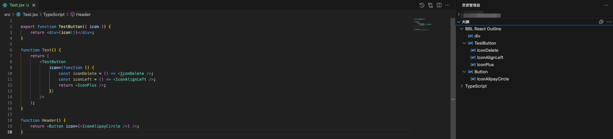

## React Outline

Fork of https://github.com/ShubhamVerma1811/vscode-react-outline A vscode extension that enables support for symbols and outlines for a React files.lists all todos in the side bar.

## About

This extension enables support for symbols and outlines for a React files.

It can detect the following types of symbols, with nested support!

- JSXElements - `<Tags></Tags>`
- JSXFragments - `<>Tags</>` or `<React.Fragment></React.Fragment>`

---

## Screenshot

Here is the screenshot with the extension enabled.

---
